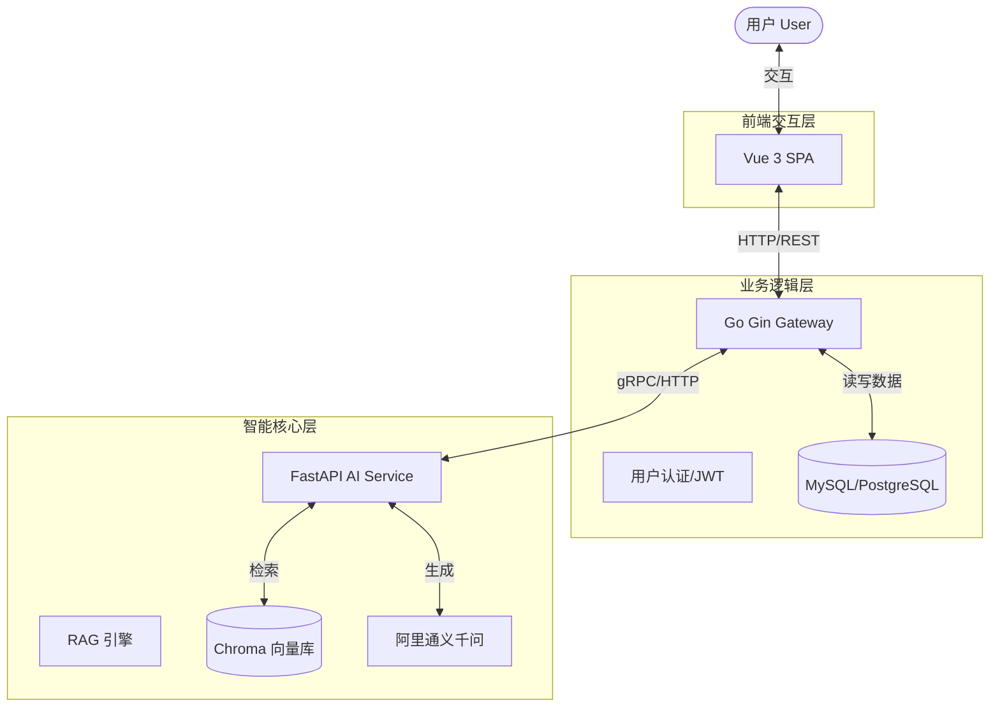

# 🐾 PetMind 宠物健康智能问答系统

PetMind 是一个基于 AI 大语言模型（LLM）与检索增强生成（RAG）技术的专业宠物医疗咨询辅助平台。旨在通过结合权威兽医知识库，为宠物主人提供比通用 AI 更准确、更可信的健康建议，减少“AI 幻觉”，缓解主人的健康焦虑。

## 🏗️ 系统架构体系

本项目采用 **微服务化** 的前后端分离架构，将业务逻辑与 AI 推理能力解耦，确保系统的可扩展性与稳定性。



## 🧩 模块功能介绍

### 1. 🧠 智能推理引擎 (`core-python/`)
本项目最核心的部分，独立运行的 AI 微服务。
- **技术栈**: Python, FastAPI, LangChain, Chroma。
- **核心职责**:
    - **RAG (检索增强生成)**: 加载并切分专业兽医文献，存储于向量数据库。
    - **LLM 编排**: 结合用户问题与检索到的上下文，调用大模型生成回答。
    - **安全风控**: 识别宠物危急重症，优先输出就医警示。
    - **详见**: [core-python/README.md](./core-python/README.md)

### 2. 🛡️ 业务网关与管理 (`backend-go/`)
处理用户业务逻辑的后端服务，是系统的“管家”。
- **技术栈**: Go (Golang), Gin Framework (规划中)。
- **核心职责**:
    - **用户管理**: 注册、登录、JWT 鉴权。
    - **数据持久化**: 存储用户宠物档案、历史问答记录。
    - **请求转发**: 接收前端请求，预处理后转发给 Python AI 引擎，可以进行限流和计费控制。
    - *(注：目前代码仓库处于初始化阶段)*

### 3. 💻 前端交互界面 (`frontend/`)
用户直接接触的 Web 界面。
- **技术栈**: Vue 3, Vite, TailwindCSS (规划中)。
- **核心职责**:
    - 提供直观的聊天界面。
    - 宠物档案录入表单。
    - 展示带有引用来源的 AI 回答。
    - *(注：目前代码仓库处于初始化阶段)*

## 🚀 快速开始

本项目核心功能集中在 `core-python` 目录。如果你仅想体验 AI 问答能力，可以直接运行该模块。

1. **克隆项目**:
   ```bash
   git clone <repository-url>
   cd PetMind
   ```

2. **启动 AI 引擎**:
   详细步骤请参考 [Core Python 文档](./core-python/README.md)。

## 📝 开发计划

- [x] **Phase 1**: Python 核心 AI 引擎原型验证 (RAG 流程跑通)。
- [ ] **Phase 2**: Go 后端基础框架搭建 (API 定义与数据库设计)。
- [ ] **Phase 3**: 前端 MVP 版本开发 (聊天界面)。
- [ ] **Phase 4**: 前后端联调与完整链路测试。
