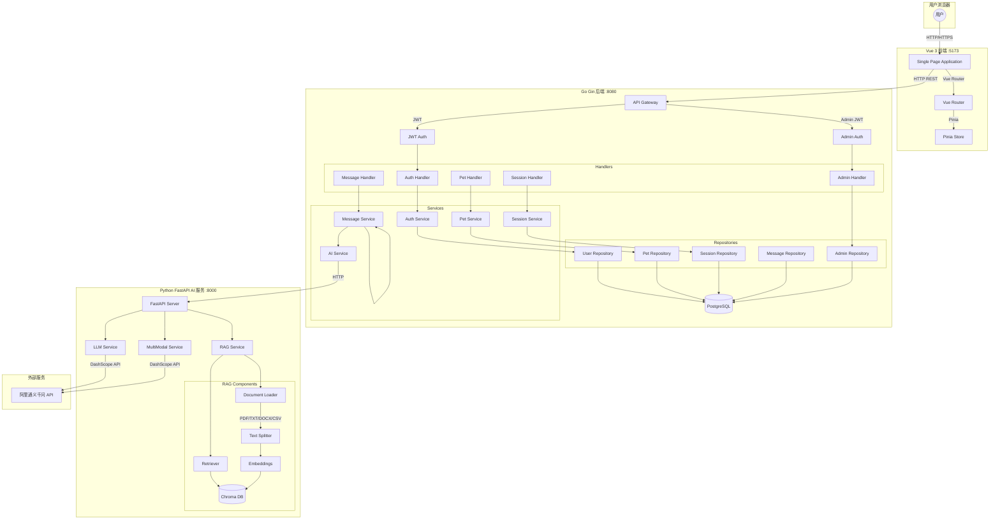
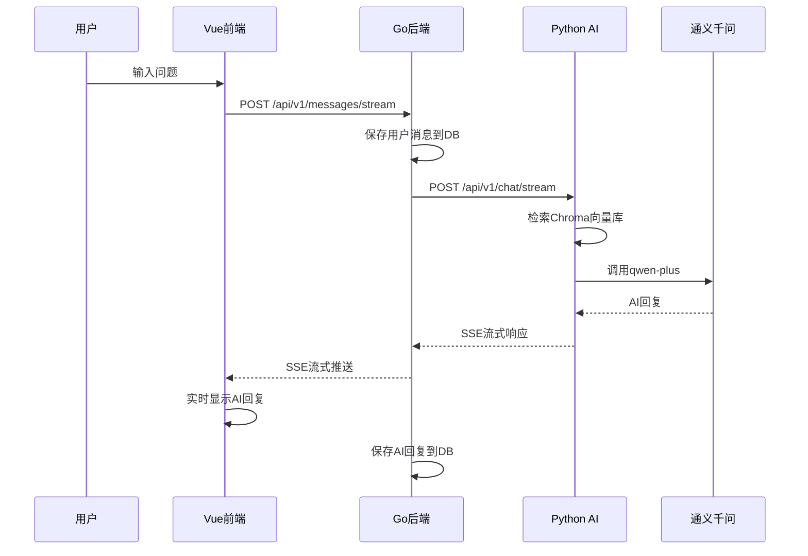
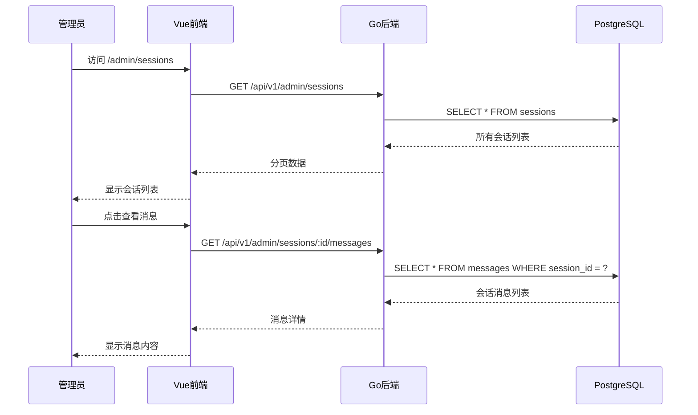

# PetMind 技术架构图

## 系统架构图



## 数据流向图

### 用户发送消息流程



### 管理员查看会话流程



## 前端架构

```
frontend/src/
├── api/                    # HTTP 客户端封装
│   ├── index.ts           # Axios 实例 + 拦截器
│   ├── auth.ts           # 用户认证 API
│   ├── pets.ts           # 宠物管理 API
│   ├── sessions.ts        # 会话管理 API
│   ├── messages.ts       # 消息 API
│   └── admin.ts          # 管理员 API
├── components/            # 可复用组件
│   ├── ChatInput.vue     # 聊天输入框
│   ├── ChatMessage.vue   # 聊天消息
│   ├── PetCard.vue       # 宠物卡片
│   └── SessionList.vue   # 会话列表
├── layouts/               # 布局组件
│   └── AdminLayout.vue   # 管理后台布局
├── stores/                # Pinia 状态管理
│   ├── auth.ts           # 认证状态
│   ├── chat.ts           # 聊天状态
│   └── pets.ts          # 宠物状态
├── views/                 # 页面组件
│   ├── Login.vue         # 用户登录
│   ├── Register.vue      # 用户注册
│   ├── Chat.vue          # 问答页面
│   ├── Pets.vue          # 宠物管理
│   └── admin/            # 管理后台页面
│       ├── AdminLogin.vue
│       ├── AdminRegister.vue
│       ├── AdminDashboard.vue
│       ├── AdminUsers.vue
│       ├── AdminPets.vue
│       ├── AdminSessions.vue
│       └── AdminSessionDetail.vue
├── router/
│   └── index.ts          # 路由配置 + 路由守卫
└── main.ts               # 应用入口
```

## 后端架构

```
backend-go/
├── cmd/server/
│   └── main.go           # 程序入口
└── internal/
    ├── config/
    │   └── config.go     # 配置加载 (Viper)
    ├── model/
    │   └── models.go     # 数据模型 + DTO
    ├── repository/
    │   ├── db.go         # 数据库初始化
    │   ├── user_repository.go
    │   ├── pet_repository.go
    │   ├── session_repository.go
    │   ├── message_repository.go
    │   └── admin_repository.go
    ├── service/
    │   ├── auth_service.go
    │   ├── pet_service.go
    │   ├── session_service.go
    │   ├── message_service.go
    │   └── ai_service.go
    ├── handler/
    │   ├── auth_handler.go
    │   ├── pet_handler.go
    │   ├── session_handler.go
    │   ├── message_handler.go
    │   └── admin_handler.go
    ├── middleware/
    │   └── middleware.go # JWT + AdminAuth
    └── router/
        └── router.go     # 路由配置
```

## RAG 引擎架构

```
core-python/app/
├── api/
│   └── v1/
│       ├── router.py    # 路由聚合
│       └── endpoints/
│           ├── chat.py         # 聊天接口
│           ├── health.py      # 健康检查
│           └── multimodal.py  # 多模态接口
├── rag/
│   ├── document_loader.py   # 文档加载 (PDF/TXT/DOCX/CSV)
│   ├── text_splitter.py    # 文本分割
│   ├── embeddings.py      # Embedding 服务
│   ├── vectorstore.py      # Chroma 向量库
│   └── retriever.py       # 检索器
├── services/
│   ├── llm_service.py       # LLM 调用
│   ├── rag_service.py      # RAG 问答
│   └── multimodal_service.py # 图片分析
└── core/
    └── config.py          # 配置管理
```
