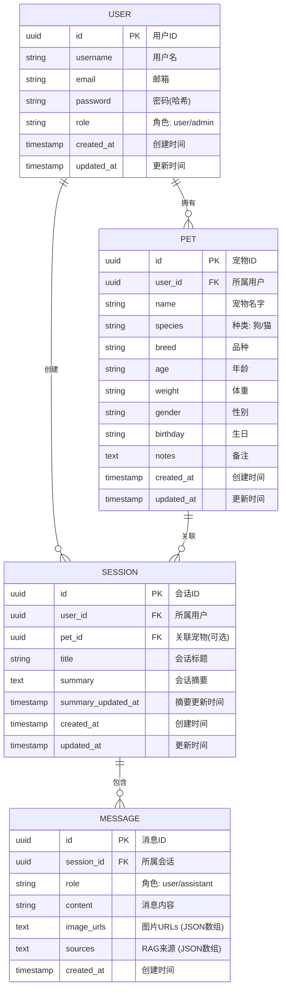

# PetMind 数据库设计

## ER 图



## 表结构说明

### users 表

| 字段 | 类型 | 约束 | 说明 |
|------|------|------|------|
| id | UUID | PK | 用户唯一标识 |
| username | VARCHAR(50) | UNIQUE, NOT NULL | 用户名 |
| email | VARCHAR(255) | UNIQUE, NOT NULL | 邮箱 |
| password | VARCHAR(255) | NOT NULL | 密码(BCrypt哈希) |
| role | VARCHAR(20) | DEFAULT 'user' | 角色: user / admin |
| created_at | TIMESTAMP | NOT NULL | 创建时间 |
| updated_at | TIMESTAMP | NOT NULL | 更新时间 |

**索引:**
- `username` - UNIQUE INDEX
- `email` - UNIQUE INDEX

### pets 表

| 字段 | 类型 | 约束 | 说明 |
|------|------|------|------|
| id | UUID | PK | 宠物唯一标识 |
| user_id | UUID | FK, NOT NULL | 所属用户ID |
| name | VARCHAR(50) | NOT NULL | 宠物名字 |
| species | VARCHAR(20) | | 种类: 狗/猫 |
| breed | VARCHAR(50) | | 品种 |
| age | VARCHAR(20) | | 年龄 |
| weight | VARCHAR(20) | | 体重 |
| gender | VARCHAR(10) | | 性别 |
| birthday | VARCHAR(20) | | 生日 |
| notes | TEXT | | 备注信息 |
| created_at | TIMESTAMP | NOT NULL | 创建时间 |
| updated_at | TIMESTAMP | NOT NULL | 更新时间 |

**索引:**
- `user_id` - 普通索引
- `user_id + name` - UNIQUE INDEX (防止同一用户下重名)

### sessions 表

| 字段 | 类型 | 约束 | 说明 |
|------|------|------|------|
| id | UUID | PK | 会话唯一标识 |
| user_id | UUID | FK, NOT NULL | 所属用户ID |
| pet_id | UUID | FK | 关联宠物(可选) |
| title | VARCHAR(200) | NOT NULL | 会话标题 |
| summary | TEXT | | 会话摘要(自动生成) |
| summary_updated_at | TIMESTAMP | | 摘要更新时间 |
| created_at | TIMESTAMP | NOT NULL | 创建时间 |
| updated_at | TIMESTAMP | NOT NULL | 更新时间 |

**索引:**
- `user_id` - 普通索引
- `pet_id` - 普通索引(可空)

### messages 表

| 字段 | 类型 | 约束 | 说明 |
|------|------|------|------|
| id | UUID | PK | 消息唯一标识 |
| session_id | UUID | FK, NOT NULL | 所属会话ID |
| role | VARCHAR(20) | NOT NULL | 角色: user / assistant |
| content | TEXT | NOT NULL | 消息内容 |
| image_urls | TEXT | | 图片URLs(JSON数组) |
| sources | TEXT | | RAG来源(JSON数组) |
| created_at | TIMESTAMP | NOT NULL | 创建时间 |

**索引:**
- `session_id` - 普通索引

## 关联关系

```
┌─────────┐       ┌─────────┐       ┌─────────┐
│  USER   │ 1───* │   PET   │       │  PET    │
└─────────┘       └─────────┘       └────┬────┘
    │                                    │
    │ 1───*                       0/1──┐ │
    ▼                                    │ │
┌─────────┐       ┌─────────┐            │ │
│ SESSION │ 1───* │ MESSAGE │            │ │
└────┬────┘       └─────────┘            │ │
     │                                   │ │
     └─────────────── 0/1 ─────────────┘ │
```

- **User → Pet**: 一对多，每个用户可拥有多只宠物
- **User → Session**: 一对多，每个用户可创建多个会话
- **Pet → Session**: 一对多可选，每个宠物可关联多个会话（宠物专属会话）
- **Session → Message**: 一对多，每个会话包含多条消息

## 级联删除规则

| 操作 | 级联删除 |
|------|----------|
| 删除用户 | 删除该用户的所有宠物 → 宠物关联的会话 → 会话中的消息 |
| 删除宠物 | 删除该宠物的所有会话 → 会话中的消息 |
| 删除会话 | 删除该会话的所有消息 |

**注意**: 管理员后台删除时执行级联删除，图片文件暂不删除。

## 管理员专属操作

管理员接口 (`/api/v1/admin/*`) 可直接操作所有用户数据，绕过用户归属限制：

| 接口 | 操作 |
|------|------|
| DELETE /admin/users/:id | 删除任意用户(含级联) |
| DELETE /admin/pets/:id | 删除任意宠物(含级联) |
| DELETE /admin/sessions/:id | 删除任意会话(含级联) |
| GET /admin/sessions/:id/messages | 查看任意会话消息 |

## PostgreSQL 配置

```sql
-- 创建数据库
CREATE DATABASE petmind;

-- 连接数据库后创建扩展(可选)
\c petmind
CREATE EXTENSION IF NOT EXISTS "uuid-ossp";
```

## 迁移说明

系统使用 GORM 的 `AutoMigrate` 功能自动迁移数据库表结构。首次启动时 GORM 会自动创建表并添加索引。

如需手动迁移，可使用以下命令：

```bash
# 进入后端目录
cd backend-go

# 运行服务，GORM 会自动迁移
go run cmd/server/main.go
```
